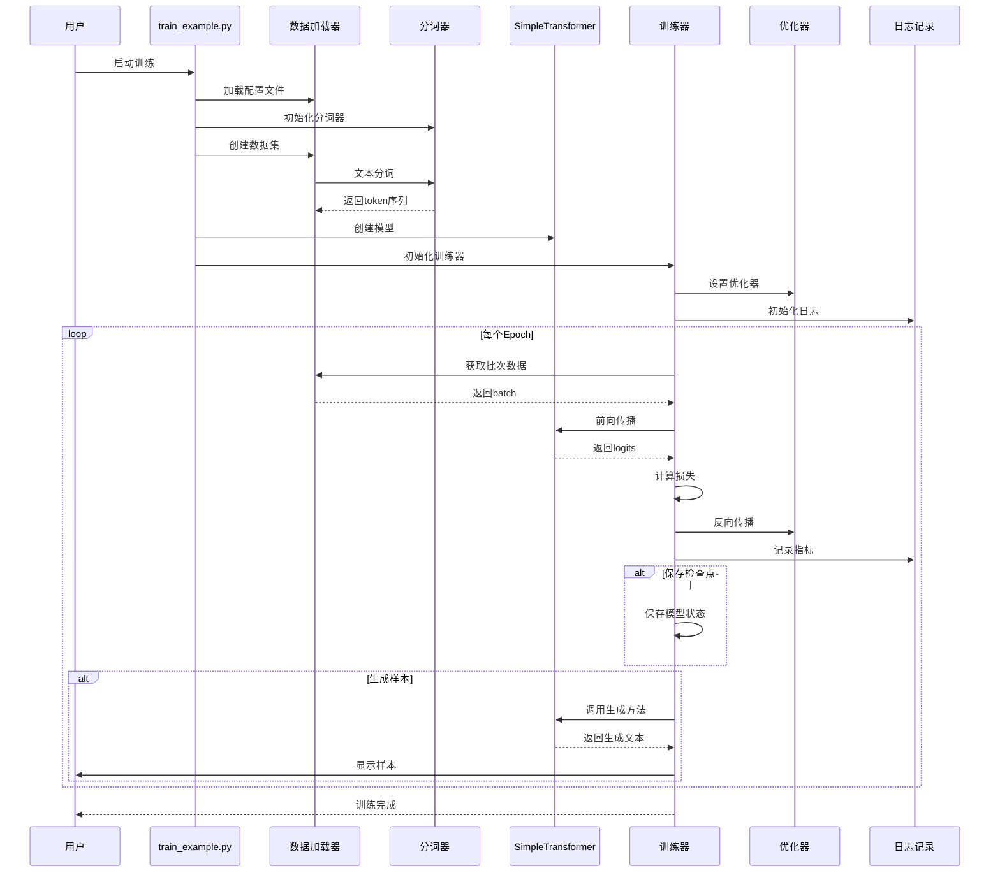
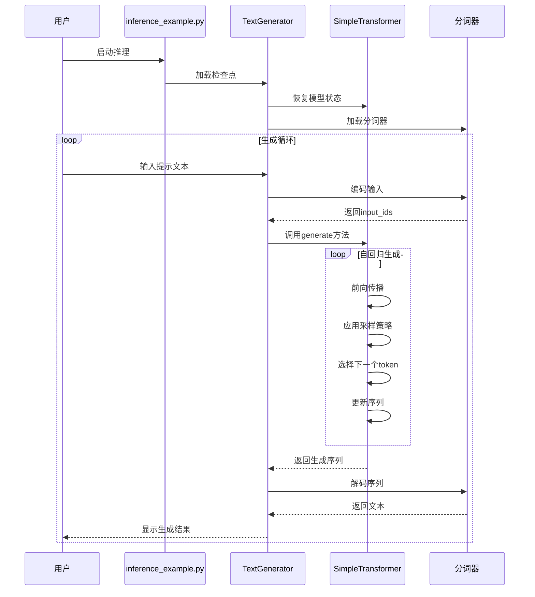
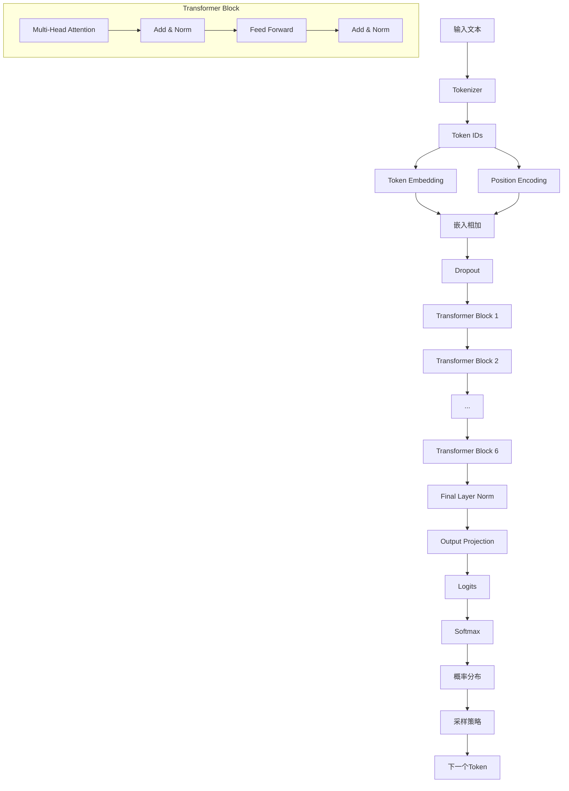
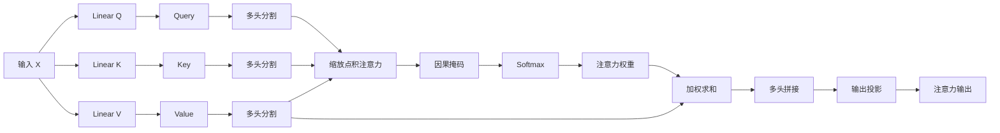

# Simple Transformer 项目总结

## 🔍 项目关键特征

基于对项目代码的深入分析，这个Transformer实现具有以下核心特征：

### 🏗️ **架构特征**

**1. 仅Decoder架构**
- 采用GPT风格的仅Decoder设计，专门用于文本生成任务
- 包含6层Transformer块，每层256维度，8个注意力头

**2. 核心组件完整实现**
- `MultiHeadAttention`：标准的缩放点积注意力机制
- `CausalSelfAttention`：带因果掩码的自注意力，防止看到未来信息
- `PositionalEncoding`：正弦余弦位置编码
- `FeedForward`：Position-wise前馈网络
- `ResidualConnection`：残差连接和层归一化

### 🎯 **生成特征**

**3. 多样化采样策略**
- 温度采样：控制生成随机性
- Top-k采样：限制候选token数量
- Top-p (nucleus)采样：基于累积概率的动态采样
- 支持批量生成和交互式生成

**4. 智能文本生成**
- 自回归生成机制
- 可配置的最大序列长度(512)
- 重复惩罚机制
- 因果掩码确保生成的合理性

### 🔧 **工程特征**

**5. 完整的训练系统**
- `Trainer`：包含完整训练循环、验证、检查点保存
- AdamW优化器 + 余弦退火学习率调度
- TensorBoard日志记录
- 梯度裁剪和权重衰减

**6. 灵活的数据处理**
- `SimpleTokenizer`：字符级分词器，支持中文
- 自动数据预处理和批处理
- 可配置的词汇表大小(10,000)

### 📊 **配置特征**

**7. 高度可配置**
- `model_config.yaml`：YAML配置文件管理所有超参数
- 模型、训练、数据、生成参数完全可调
- 支持检查点加载和恢复训练

**8. 轻量级设计**
- 约1M参数量，适合个人电脑训练
- 支持CPU和GPU训练
- 内存友好的实现

### 🎓 **教育特征**

**9. 清晰的代码结构**
- 模块化设计，每个组件独立实现
- 详细的中文注释和文档
- 完整的使用示例和教程

**10. 实用性**
- 开箱即用的训练和推理脚本
- 支持自定义数据训练
- 完整的项目文档和快速开始指南

### 🌟 **技术亮点**

- **标准Transformer实现**：严格按照"Attention Is All You Need"论文实现
- **因果注意力机制**：正确实现语言模型的自回归特性
- **多种采样策略**：提供灵活的文本生成控制
- **完整工程化**：从数据处理到模型部署的全流程实现
- **中文友好**：专门优化了中文文本处理

## 📊 项目实现时序图

### 训练流程时序图

### 推理流程时序图

### 模型架构数据流图

### 注意力机制详细流程

## 🎯 项目价值

这个项目是学习Transformer架构的优秀起点，既保持了理论的完整性，又具备了实际应用的可行性。通过这个实现，开发者可以：

1. **深入理解Transformer原理**：从底层实现理解注意力机制、位置编码等核心概念
2. **掌握深度学习工程实践**：学习完整的训练、验证、推理流程
3. **体验文本生成技术**：实际操作各种采样策略和生成控制方法
4. **为进阶学习打基础**：为学习更复杂的大语言模型做准备

项目代码清晰、文档完善、功能完整，是深度学习和NLP领域的优秀学习资源。